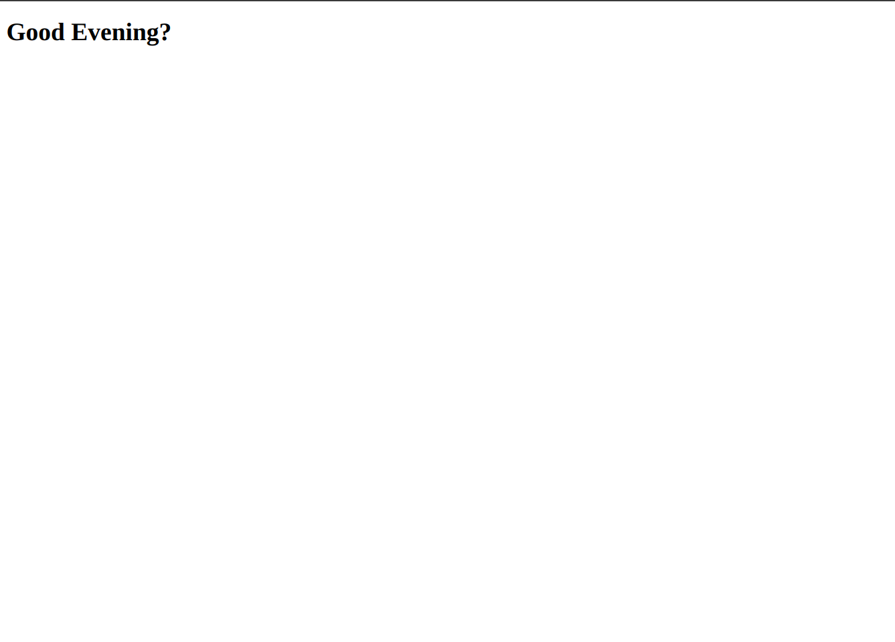

## Description

The hello react font end is created to help me learn how to integrate rails back end code that will be used by a front end react app




## Built With

- Ruby
- Ruby on Rails

## Getting Started

To get the content of this project locally you need to run this command in your terminal:
Mak sure the server is running from the [backend project](https://github.com/matovu-farid/hello-rails-back-end)
``` bash
git clone your https://github.com/matovu-farid/hello-react-front-end.git
cd hello-react-front-end
npm install
npm start
```

## Backend end
This is a link to the backend github [project](https://github.com/matovu-farid/hello-rails-back-end)
```
https://github.com/matovu-farid/hello-rails-back-end
```

## Authors

👤 **Matovu Farid Nkoba**

- GitHub: [@matovu-farid](https://github.com/matovu-farid)
- Twitter: [@matovu100](https://twitter.com/matovu100)
- LinkedIn: [matovu-farid](https://www.linkedin.com/in/matovu-farid-48b80257)


## Show your support

Give a ⭐️ if you like this project!

## Acknowledgments

- Hat tip to Microverse


## 📝 License

This project is [MIT](./MIT.md) licensed.
